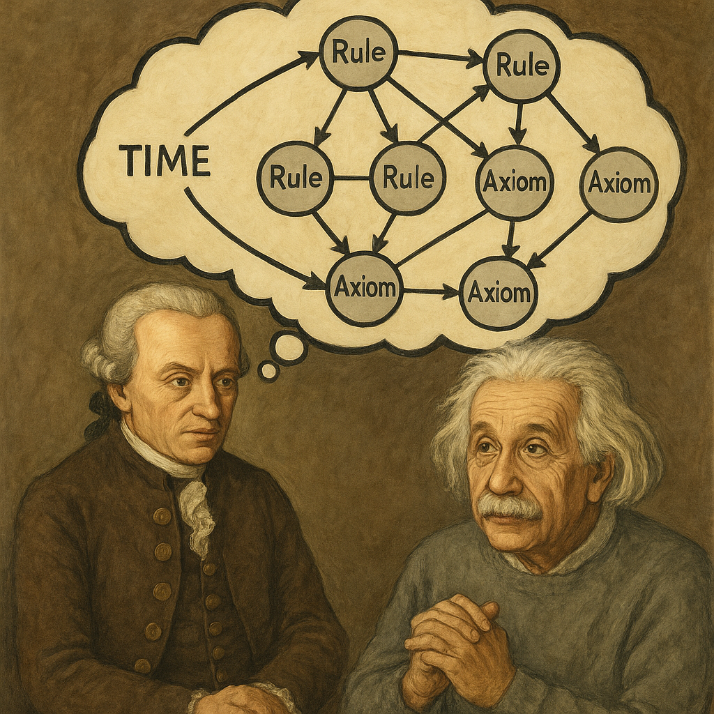

# Transformational Creativity System

This repository contains the codebase for the paper **"Towards AI Super-Scientists: Transformationally Creative Idea Generation via Graph-Enabled LLM Search"**. It provides implementations and resources for leveraging graph-based search techniques with large language models (LLMs) to facilitate transformational creativity in scientific idea generation.

## Repository Structure

- `src/` — Core source code implementing graph-enabled LLM search and idea generation algorithms.
- `experiments/` — Scripts and configurations for running experiments and evaluating results.
- `data/` — Sample datasets and resources used for testing and demonstration.
- `docs/` — Documentation, including usage guides and technical details.
- `models/` — Pre-trained models and checkpoints relevant to the system.
- `examples/` — Example workflows and use cases illustrating system capabilities.

Refer to the documentation in the `docs/` folder for setup instructions and detailed usage.
